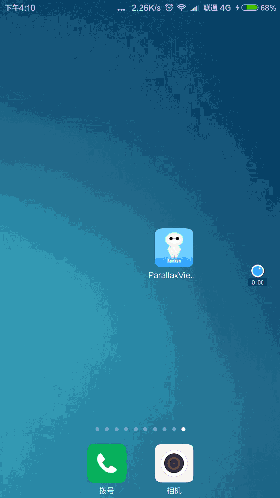

# ParallaxViewPager
  
## Summary 
* 高仿小米MIUI锁屏主题
* ParallaxViewPager视差
* ReboundDamping阻尼回弹

### 中文
* 由于本Demo异样化较强，所以我并没有将其封装起来，关键类只有三个，所以，下载并更改它按照自己的意愿吧！

### English
* Because of this strange Demo strong, so I did not wrap it up, only three key classes, so, download it and change it as they wish!

### screen shot 截屏
 
### gif 动态图
* 注意程序刚启动时向左滑动一段距离是在代码中控制的:bowtie:
* 如果动态图没加载出来or卡顿-试一下刷新页面吧!
[refresh](https://github.com/gm365066360/ParallaxViewPager "刷新页面")  

  
* 这张是滑动到最右边

 
* 另一种风格的-注意标题-beautiful girl

 
### apk 
* [This is apk](./gifAndapk/parallaxViewPager.apk "apk")
* [This is also(apk)](http://fir.im/6vxd "apk")

### Star
> 点赞是一种美德!（Thumbs up is a virtue!）
>> what!你不知道哪里点赞?(You do not know where to click?)
>>>oh my! find :star: Star 
>>>>and click it
